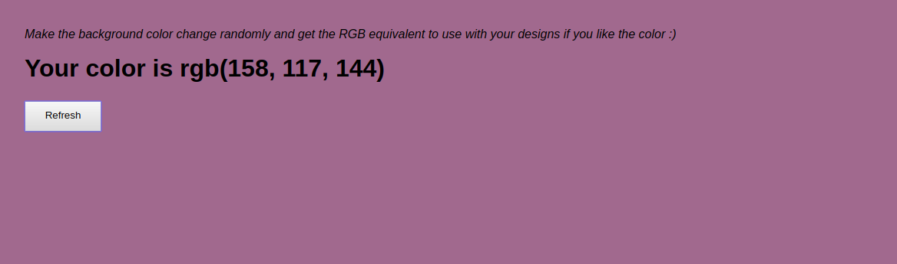

## ABOUT

This is a React Project that randomly changes the background color of the webpage 
and provides the corresponding RGB code.



It is meant to help designers pick the most suitable background color for their designs :)

###### Sample code
```jsx
class App extends Component {

   constructor(props)
  {
    super(props);
    this.state = {color: [210, 156, 241]};
    this.handleClick = this.handleClick.bind(this);
  }
  
  componentDidMount() {
    this.applyColor();
  }

  componentDidUpdate(prevProps, prevState) {
    this.applyColor();
  }

  formatColor(ary) {
    return 'rgb(' + ary.join(', ') + ')';
  }

  isLight() {
    const rgb = this.state.color;
    return rgb.reduce((a,b) => a+b) < 127 * 3;
  }

  applyColor() {
    const color = this.formatColor(this.state.color);
    document.body.style.background = color;
  }

  chooseColor() {
    const random = [];
    for (let i = 0; i < 3; i++) {
      random.push(Math.floor(Math.random()*256));
    }
    return random;
  }
  
  handleClick()
  {
    this.setState({
      color:this.chooseColor()
    })
  }

  render() {
    return (
      <div style={{padding: 70}}>

      <i>Make the background color change randomly and get the RGB equivalent to use with your designs if you like the color :)</i>
        <h1 className={this.isLight() ? 'white' : 'black'}>
        Your color is {this.formatColor(this.state.color)}
        </h1>
        <Button light={this.isLight()} onClick = {this.handleClick} />
        
      </div>
    );
  }
}

export default App;


```

This project was bootstrapped with [Create React App](https://github.com/facebookincubator/create-react-app).
